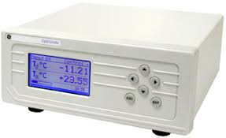

# GEOptiSonde.jl



The General Eastern OptiSonde is a dew-point sensor with ± 0.2 °C accuracy. This package provides a julia driver for RS 232 communication with the device. 

## Installation

```julia
pkg> add https://github.com/mdpetters/GEOptiSonde.jl.git
```

The package dependencies include Reactive, LibSerialPort, Dates, and DataStructures.

## Example usage

The device is streaming data to the serial port at ~2 s resolution. Data is read by polling the port at some specified interval. The return string is parsed and placed into a circular buffer. The last valid dewpoint value of the circular is timestamped and placed into a Reactive signal. This way the polling loop speed is independent of the instrument sampling rate.

```julia
using GEOptiSonde

# configure serial port
port = GEOptiSonde.configure_port("/dev/ttyUSB3")

# The variable GEOptiSonde.Td is a reactive signal consisting 
# of a tupe (date, value), where date is the time stamp and value
# is the dewpoint.

# the print loop is called on every update of Td
printLoop = map(println, GEOptiSonde.Td)

# create a 1 Hz polling loop to query the port
oneHz = every(1.0)
pollLoop = map(_ -> GEOptiSonde.read(port), oneHz)
```

Example output is below. Note that the instrument is polled every second, but the signal is updated only when data accumulated on the port, which is approximately every two seconds. It is also possible to run the query loop slower than the instrument, in which case the latest output will be placed in the signal loop.

```julia
(2020-07-10T13:33:18.555, 16.92)
(2020-07-10T13:33:20.557, 16.921)
(2020-07-10T13:33:22.559, 16.921)
(2020-07-10T13:33:24.562, 16.921)
(2020-07-10T13:33:26.563, 16.921)
(2020-07-10T13:33:28.566, 16.922)
(2020-07-10T13:33:30.568, 16.922)
(2020-07-10T13:33:33.57, 16.923)
```
